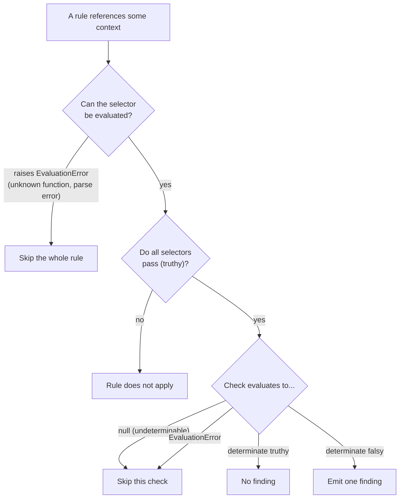
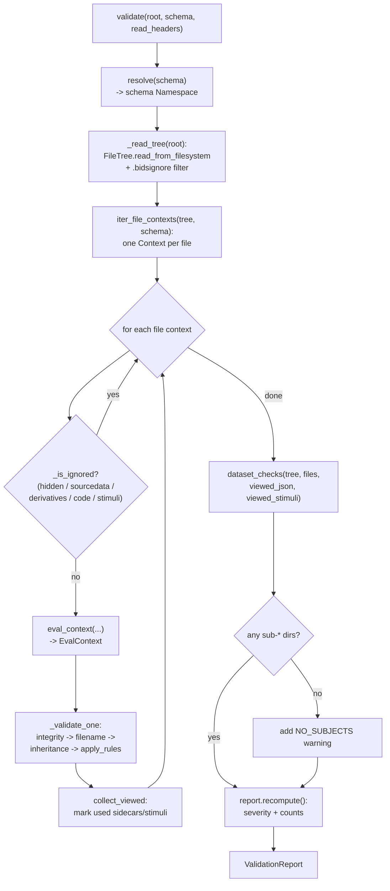
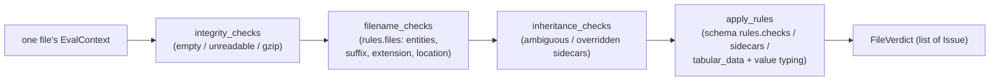
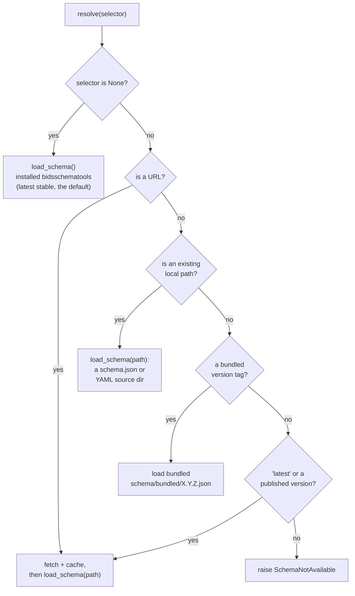
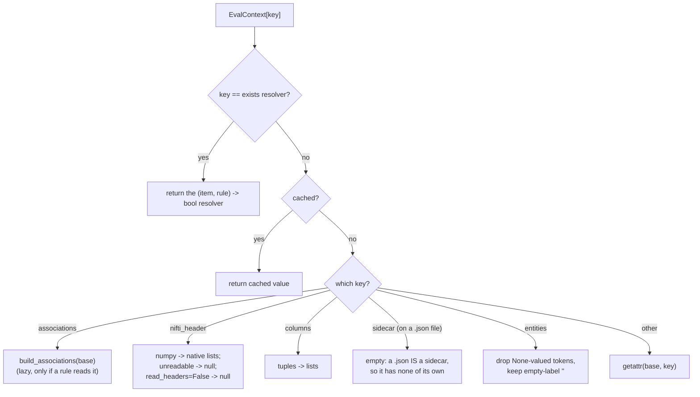
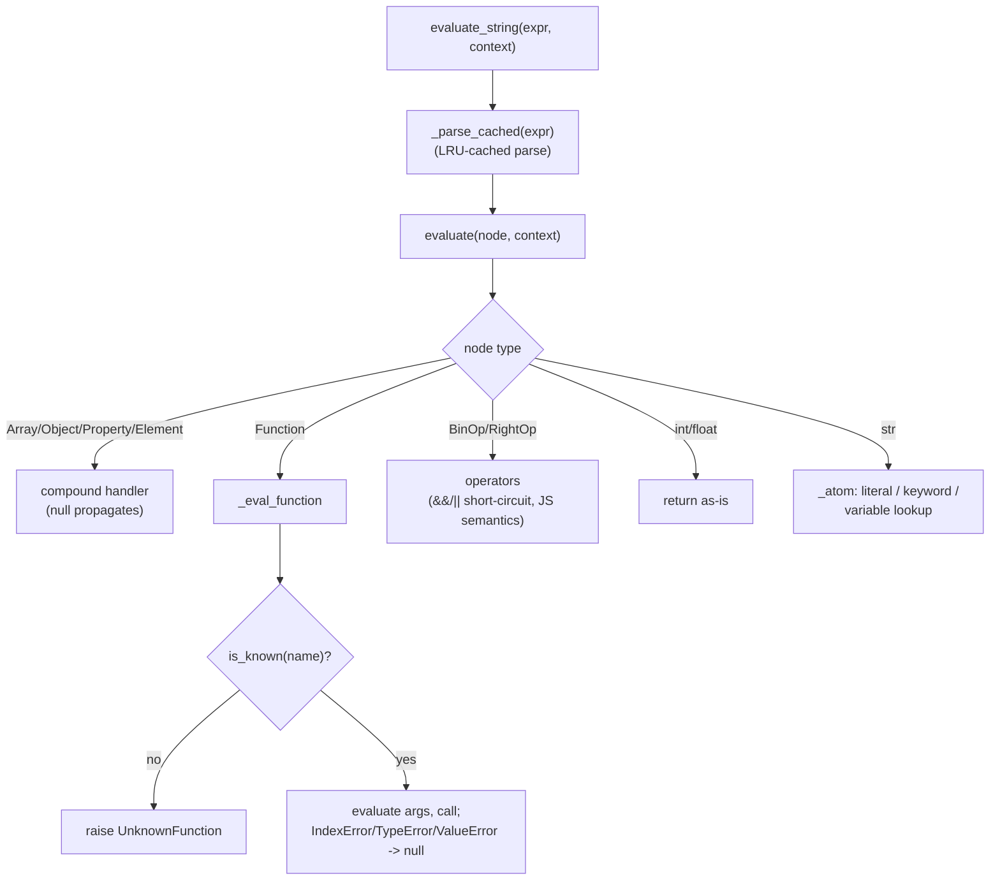
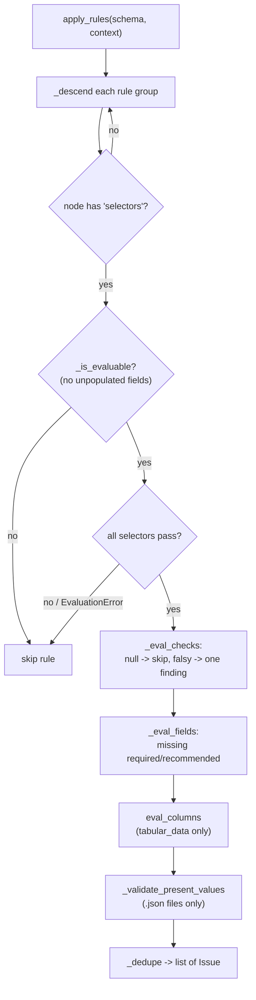
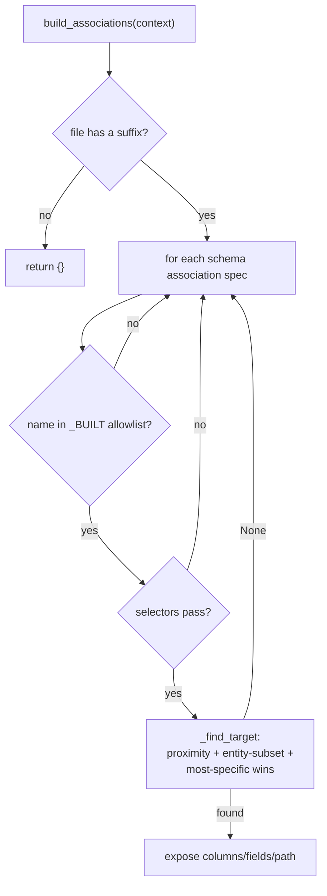

# Architecture: how the validator works

A fine-grained developer guide to the full-validation engine. It explains the
design bets, the data flow end to end, the key functions and why they exist, and
the invariant that holds the whole thing together: **never emit a false
positive.** Diagrams are Mermaid (GitHub renders them inline).

- [The one big idea](#the-one-big-idea)
- [The never-false-positive invariant](#the-never-false-positive-invariant)
- [Top-level pipeline](#top-level-pipeline)
- [Schema resolution](#schema-resolution)
- [The file model and per-file context](#the-file-model-and-per-file-context)
- [The expression engine](#the-expression-engine)
- [The rule engine](#the-rule-engine)
- [The hand-ported rule families](#the-hand-ported-rule-families)
- [Associations](#associations)
- [The result model and renderers](#the-result-model-and-renderers)
- [Module map](#module-map)

All paths below are under `src/bids_validator/`. The full engine lives in
`validation/`; the original package files (`context.py`, `types/files.py`,
`bidsignore.py`, `bids_validator.py`) are reused mostly unchanged.

## The one big idea

The single design bet is that **the BIDS schema is the engine, not a checklist
bolted on at the end.** Every datatype, entity, suffix, extension, metadata field
definition, and the rules themselves are read from the
[`bidsschematools`](https://github.com/bids-standard/bids-specification) schema at
runtime. Nothing about BIDS is hardcoded. Point the validator at a different
schema and its entire vocabulary and rule set change with it (see
[Schema resolution](#schema-resolution)).

Three structural choices follow from that bet:

1. **One schema flows through everything.** A single resolved schema `Namespace`
   is threaded into every layer; nothing else ever branches on the BIDS version.
2. **One I/O path.** Every file is read through a small set of cached loaders in
   `context.py`. The engine-facing context (`EvalContext`) adapts types but never
   opens a second read path, so each file is read at most once.
3. **Pure data, no orchestrator class.** Findings are plain `attrs` records;
   orchestration is straight-line code in `validation/validate.py`.

## The never-false-positive invariant

The porting contract from the Deno reference validator is strict: **the Python
validator's findings must be a subset of the reference's.** A finding is only
emitted when the validator can *prove* a violation from the available context.
Anything undeterminable is skipped, never reported.

This is implemented as a layered set of skip gates:



The same philosophy appears everywhere below: a missing context variable resolves
to `null` rather than raising; an unreadable NIfTI header degrades to `null`; an
unparseable column pattern falls back to "accept everything"; a symlinked
(unfetched git-annex) file is skipped; an incompatible sidecar redefinition is
ignored in favour of the schema; a directory recording is treated as one unit and
never descended into. Each of these is a place where a naive validator would emit
a false positive, and each is deliberately defused.

## Top-level pipeline

`validate(root, *, schema=None, read_headers=True, max_rows=1000)`
(`validation/validate.py:68`) is the orchestrator. It never raises on a bad
dataset: every problem becomes a finding, and one unvalidatable file cannot abort
the run.



Per-file work happens in `_validate_one` (`validate.py:168`), which runs four
checkers in order and wraps them in a blanket `try/except` that turns any
unexpected error into a single `bids_validator.internal_error` *warning*. One bad
file can never abort the whole run.



`validate_file(root, relpath, ...)` (`validate.py:133`) reuses the same machinery
but indexes the whole dataset (so inheritance and association resolution still
work) and returns only the named file's `FileVerdict`.

Default-ignored top directories (`sourcedata`, `derivatives`, `code`, `stimuli`)
and hidden paths are filtered by `_is_ignored` (`validate.py:49`), matching the
reference validator's defaults.

## Schema resolution

`validation/schema/resolve.py` is the only module that decides *which* schema is
used. Everything else receives one resolved `Namespace`.



- **Bundled, offline.** Six dereferenced schemas ship in
  `validation/schema/bundled/` (1.8.0, 1.9.0, 1.10.0, 1.10.1, 1.11.0, 1.11.1).
  `available_versions()` lists them, numerically sorted so `1.9.0` precedes
  `1.10.0`. A leading `v` (`v1.11.1`) is accepted.
- **Loading.** A bundled file, a local `schema.json`, or a YAML source directory
  all go through `bidsschematools.schema.load_schema`, which picks the right
  loader by inspecting the path. Loads are LRU-cached, so resolving the same
  selector repeatedly is free.
- **Fetch + cache.** `schema/cache.py` downloads `latest`, a non-bundled
  version, or a URL from the BIDS specification site and caches it under
  `$XDG_CACHE_HOME/bids-validator/schemas` (keyed by a hash of the URL), using
  `certifi`'s CA bundle when available.
- **Forward compatibility.** `EvalContext` reads the advertised context-variable
  names defensively: modern schemas put them under `meta.context.properties`,
  legacy 1.8.0/1.9.0 under `meta.context.context.properties`. An unknown shape
  degrades to an empty key set, so an older schema validates with reduced
  coverage instead of crashing.

`schema_introspect.py` is the read-only vocabulary reader over a resolved schema:
`datatypes()`, `suffixes()`, `extensions()` (longest-first so `.nii.gz` wins over
`.gz`), `short_to_long()`, `entity_pattern()`, `metadata_by_name()`, and
`directory_recordings()` (extensions ending in `/`, like `.ds`, `.mefd`,
`.ome.zarr`). Results are memoized per schema `id()`.

## The file model and per-file context

Three files build the per-file view the rule engine evaluates against.

### FileTree (`types/files.py`)

An immutable `attrs` tree over a `universal_pathlib` `UPath` (so the same model
works over a local filesystem, a zip, or S3). `read_from_filesystem` materializes
the whole tree up front in one directory pass, so later validation does zero
directory listing, only cached content reads. `parent` and `children` are
excluded from equality and hashing, which keeps the frozen tree hashable and
therefore usable as a `@cache` key for the content loaders. Useful members:
`relative_path` (POSIX, trailing slash on directories), `__contains__` (the
membership test the `exists()` resolver relies on), and `__truediv__`.

### The base context (`context.py`)

The single I/O path. Module-level, cached loaders are the only place file
*contents* are read:

- `load_tsv` / `load_tsv_gz` open with `utf-8-sig` (BOM-safe), transpose rows to
  columns, and drop fully-blank lines so a trailing newline neither adds a
  spurious value nor truncates the transpose.
- `load_json` (orjson), `load_nifti_header` (the only header reader; normalizes
  nibabel quirks but keeps numpy arrays), `load_sidecar` (inheritance-principle
  merge of JSON sidecars, nearer files winning).

`Context` (`context.py:388`) is the lazy per-file view: `path`, `entities`,
`datatype`, `suffix`, `extension`, `size`, `columns`, `json`, `nifti_header`,
`sidecar`. `FileParts.from_file` parses a filename; a no-hyphen token (the
`dataset` in `dataset_description.json`) becomes an entity with value `None`,
which matters downstream.

### EvalContext (`validation/context.py`)

A read-only `Mapping` the rule engine evaluates expressions against. It delegates
every base variable to `Context` (preserving the single I/O path) and intercepts
exactly five keys so the evaluator only ever sees native types and correct
semantics:



Why each interception exists:

- **`nifti_header` numpy to native.** The expression language indexes header
  fields as plain-number arrays. An un-indexable numpy array would silently yield
  `null` and produce a false positive on *every* NIfTI; flattening here keeps
  numpy out of the evaluator.
- **`sidecar` empty on a `.json`.** A JSON file *is* a sidecar, so by the
  inheritance principle it has no sidecar of its own. This also prevents
  double-reporting a data file's metadata (checked once via the data file).
- **`entities` drops `None`.** The no-hyphen `dataset` token is not a BIDS
  entity; dropping it avoids a phantom `FILENAME_MISMATCH`. An empty label `""`
  is kept because that is itself a finding.

`iter_file_contexts` + `_walk` (`validation/context.py:222`) turn a `FileTree`
into one `Context` per file. The crucial guard: a directory recording
(`.ds`/`.mefd`/`.ome.zarr`, discovered from the schema, not hardcoded) is yielded
as **one** context and **not descended into**, so its internal chunks are never
flagged as stray empty files.

## The expression engine

`validation/expressions.py` is the evaluator for the BIDS schema expression
language (selectors like `suffix == 'T1w'` and checks like
`"RepetitionTime" in sidecar`). Parsing is delegated to
`bidsschematools.expressions.parse`; this module walks the AST against a context.



Key design points:

- **Null means "not determinable".** A missing variable resolves to `None`
  (`_lookup` returns `None` on absence); `null.x`, `null[i]`, and arithmetic or
  ordering with a null operand all propagate `null`. Operations that *could*
  raise (bad regex, zero division, wrong arity, non-numeric coercion) are caught
  and degraded to `null`. The rule engine then skips a null result.
- **JavaScript semantics, deliberately.** `truthy()` mirrors JS (empty `[]` and
  `{}` are truthy; empty string is falsy); `&&`/`||` return the operand, not a
  coerced bool; `_equal` treats `null` as equal only to `null`. The schema was
  authored against the JS reference, so matching it exactly is correctness.
- **A 13-function table** (`_FUNCTIONS`) implements `type`, `intersects`,
  `match`, `substr`, `min`, `max`, `length`, `unique`, `count`, `index`,
  `allequal`, `sorted`, and `exists`. Keeping it an explicit table makes the
  supported set auditable against the schema. An unknown function (a
  newer-than-engine schema) raises `UnknownFunction` (a subclass of
  `EvaluationError`, so existing handlers skip the rule for free).
- **`sorted` is position-preserving for non-numbers** (`_numeric_sorted`). A
  comparator that maps every NaN comparison to "equal" is not a valid total
  order, so a `cmp_to_key` sort is algorithm-dependent and diverged between
  CPython 3.10 and 3.11+. The position-preserving implementation is deterministic
  across Python versions. (The same class of bug was fixed in bidsval.)
- **Correctness oracle.** The 77 `meta.expression_tests` vectors in the schema
  pin the evaluator's semantics; `tests/validation/test_expressions.py`
  parametrizes over all of them.

The one exception to null-skip: `exists()` returns `0` (not `null`) when no
file-tree resolver is wired, so an existence check fails-as-absent rather than
skipping. In normal validation the resolver is always supplied by
`eval_context`.

## The rule engine

`validation/engine.py::apply_rules` (`engine.py:71`) is the schema-rule
interpreter. It evaluates four rule groups for one file:
`checks` (generic selector-gated booleans), `sidecars` and `dataset_metadata`
(required/recommended field rules), and `tabular_data` (TSV column rules).



How each piece works:

- **`_eval_checks`** (`engine.py:156`): a rule's checks are an AND; the first
  determinate falsy check emits exactly one finding. A `null` check is skipped
  (not determinable); an `EvaluationError` skips that check.
- **`_eval_fields`** (`engine.py:211`): for `sidecars` (read the data file's
  inheritance-merged sidecar) and `dataset_metadata` (read
  `dataset_description.json`), emit a finding for each required (`ERROR`) or
  recommended (`WARNING`) field that is absent. `optional`/`prohibited` map to
  `IGNORE`. A conditional `level_addendum` ("required if X is Y") is honoured.
  Files that cannot carry a sidecar (`.json`, `.md`, ...) are exempt.
- **`_validate_present_values`** (`engine.py:296`): runs only on `.json` files,
  validating each present field's value against its
  `schema.objects.metadata` definition. A field name may map to several
  definitions; a finding is emitted only when the value fails *every* one, so
  duplicate field names never cause a false positive. Restricting to `.json`
  files avoids double-reporting a data file's merged-sidecar values.
- **`_UNPOPULATED_FIELDS`** (`engine.py:50`): a regex skip gate for rules that
  reference context aggregates not built yet (`gzip`, `ome`, `tiff`,
  `coordsystems`, `atlas_description`). The word boundary leaves the singular
  `coordsystem` association untouched.

## The hand-ported rule families

Some checks need more than a boolean schema expression. These are ported by hand
from the reference validator's TypeScript, each a strict subset of its findings.

### Integrity (`rules/integrity.py`)

Per-file structural problems that occur before any schema rule can apply:
`EMPTY_FILE`, `NIFTI_HEADER_UNREADABLE`, `INVALID_GZIP`, all at `ERROR` (matching
the reference). Two non-obvious points:

- **A symlink is skipped** (`integrity.py:54`): an unfetched git-annex file is a
  symlink with no local content and must never be reported as empty or
  unreadable. This is the module's central never-false-positive guard.
- **An empty NIfTI emits both** `EMPTY_FILE` and `NIFTI_HEADER_UNREADABLE`,
  because the reference does: the checks do not gate each other. The header check
  is gated on `read_headers`, so the fast structural pass (`--no-headers`) does
  not falsely flag every NIfTI.

### Filenames (`rules/filenames.py`)

Filename and path legality against `rules.files`. It finds which rule(s) a file
matches, then checks entities, labels, suffix, extension, datatype folder, and
location. No match yields `NOT_INCLUDED`. Derivative rules
(`rules.files.deriv.*`) are unconditionally skipped, since default validation
covers raw files only. Notable guards: `INVALID_ENTITY_LABEL` fires only when the
schema actually supplies a value pattern; `MISSING_REQUIRED_ENTITY` is suppressed
for a shared sidecar at the dataset root; when several rules match,
`ALL_FILENAME_RULES_HAVE_ISSUES` is suppressed if the file cleanly satisfies any
one of them. Every finding here is `ERROR`. This is the schema-rule companion to
the legacy `BIDSValidator.is_bids`; `validate` uses this one so the two never
double-report.

### Inheritance (`rules/inheritance.py`)

Two findings about how JSON sidecars apply to a data file, evaluated from the data
file's perspective: `MULTIPLE_INHERITABLE_FILES` (`ERROR`, an ambiguous set of
applicable sidecars with no exact entity match) and `SIDECAR_FIELD_OVERRIDE`
(`WARNING`, a less-specific sidecar sets a field a more-specific one overrides).
The companion `applicable_sidecar_files` resolves the one winning sidecar per
ancestor level and feeds the dataset-level "viewed" tracking.

### Tabular data (`rules/tables.py`, `column_types.py`, `values.py`, `guidance.py`)

`eval_columns` turns one `tabular_data` rule plus a file's parsed columns into
findings: required-column presence (`TSV_COLUMN_MISSING`), extra-column policy
(`allowed`/`allowed_if_defined`/`not_allowed`), index uniqueness, initial-column
ordering, the deprecated `89+` age value, and per-column value typing. Value
typing is one finding per column (`TSV_VALUE_INCORRECT_TYPE`, matching the
reference's count) with every offending row in `Issue.lines` so a GUI can
highlight all bad cells. `.tsv.gz` files are skipped entirely (they are
headerless; their columns are named by the sidecar). `column_types.py` compiles a
column's effective constraints (refining the schema signature with the sidecar,
where a sidecar may only narrow, never widen), and an unparseable pattern falls
back to "accept everything". `values.py` validates JSON scalar values against
`schema.objects.metadata` with a pragmatic subset of JSON Schema (type, enum,
numeric bounds, array items, `anyOf`). `guidance.py` synthesises the "how to fix"
text from the definition itself, so examples stay correct as the schema evolves.

### Dataset-level (`rules/dataset_checks.py`, `citation.py`, `bidsignore.py`)

After the per-file pass, `dataset_checks` runs four cross-file checks:
`CASE_COLLISION` (paths differing only by case, an `ERROR` for case-insensitive
filesystems), `SIDECAR_WITHOUT_DATAFILE` (a `.json` no data file uses, `ERROR`),
`UNUSED_STIMULUS` (`stimuli/` files no `events.tsv` references, `WARNING`), and
`CITATION_CFF_VALIDATION_ERROR`. The `NO_SUBJECTS` warning is added by `validate`
itself.

The correctness key here is that "used" is *replayed, not recomputed*:
`collect_viewed` records which sidecars and stimuli the per-file pass actually
resolved (via inheritance and associations), so a file counts as used exactly
when the reference validator would count it. `citation.py` only checks what cannot
false-positive: valid YAML, a mapping, and the three keys CFF always requires;
every environmental ambiguity (missing, empty, symlink, unreadable) is skipped.
`bidsignore.py` prunes the `FileTree` by `.gitignore`-style patterns before
validation; an unsupported inverted (`!`) pattern raises, and `_read_tree` catches
it to validate the unfiltered tree rather than risk hiding files.

## Associations

`validation/associations.py::build_associations` resolves, for one data file, the
companion files that travel with it (events, bval/bvec, channels, ASL context,
fieldmap magnitudes, coordsystem/electrodes, physio) and exposes each under
`associations.<name>` so schema expressions can read its columns and fields. It is
built lazily (only when a rule reads `associations`) and cached per file.



The `_BUILT` allowlist is the explicit boundary of "associations we can build
correctly". Two schema names (`atlas_description`, `coordsystems`, the plural
aggregate) are deliberately left out so any rule referencing them sees a missing
key and is skipped, rather than the module fabricating a partial aggregate. An
absent association is simply not added to the output, so `associations.<name>`
resolves to `null` downstream and its rules skip.

## The result model and renderers

Findings are pure-data `attrs` records, so a report serialises cleanly and binds
to a CLI, a GUI, or a machine-readable format.

- **`Issue`** (`issues.py:108`): `code`, `severity` (a `Severity` enum,
  `IGNORE < WARNING < ERROR`), `location`, `sub_code`, `message`, `suggestion`,
  `rule`, `line`/`lines` (tabular row highlighting), plus two extras beyond the
  reference: `provenance` (the selectors and checks that produced it, for an
  "explain" feature) and `fix` (a machine-actionable remediation hint).
- **`FileVerdict`** holds one file's `path`, rolled-up `severity`, and `issues`.
- **`ValidationReport`** (`report.py:44`) holds `bids_version`,
  `schema_version`, `dataset_issues`, `files`, `severity`, and per-finding
  `counts`. `recompute()` rolls up severity and counts (every finding counted
  once); `is_valid` is "no errors"; `filtered(severities)` returns a copy keeping
  only chosen severities (validity is unaffected, it always depends on errors).

Four renderers in `validation/render/` are pure functions of a report:
`to_text` (the CLI summary), `to_json`/`to_dict` (a flat shape: metadata, counts,
one `issues` list), `to_sarif` (SARIF 2.1.0 for code scanning), and `to_html` (a
self-contained document). The format-to-renderer registry (`RENDERERS`,
`EXTENSIONS`) is the single source the CLI dispatches from.

## Module map

```
validation/
  validate.py        orchestration: validate() / validate_file()
  engine.py          the schema-rule interpreter (apply_rules)
  expressions.py     the schema expression evaluator (+ the 13-function table)
  context.py         EvalContext + iter_file_contexts (the engine-facing context)
  associations.py    build_associations (companion-file resolution)
  schema_introspect.py   read BIDS vocabulary out of a schema
  schema/            schema selection: resolve.py, cache.py, bundled/*.json
  rules/
    integrity.py     EMPTY_FILE / NIFTI_HEADER_UNREADABLE / INVALID_GZIP
    filenames.py     rules.files: entities, suffix, extension, location
    inheritance.py   ambiguous / overridden sidecars
    tables.py        TSV column presence/order/index/value-typing
    column_types.py  the value-signature compiler + cell checker
    values.py        JSON metadata value typing
    guidance.py      schema-sourced "how to fix" text
    dataset_checks.py  case collisions, orphan sidecars, unused stimuli
    citation.py      CITATION.cff
  render/            text / json / sarif / html
  report.py          ValidationReport, FileVerdict
  issues.py          Issue, Severity, Fix, RuleProvenance, DatasetIssues

context.py           base Context + the cached content loaders (single I/O path)
types/files.py       the immutable FileTree
bidsignore.py        .bidsignore pattern matching
bids_validator.py    the legacy is_bids filename check (unchanged)
```

The dependency direction is strict: `schema_introspect` and `schema/` import
nothing from the rest of the engine; the rule families import the engine context
and expression evaluator; `validate.py` wires them together. There is no `Pipeline`
class and no module-level mutable state beyond the per-schema memo caches.
