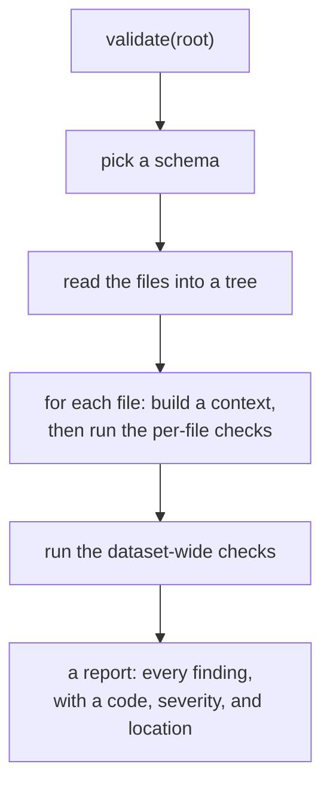
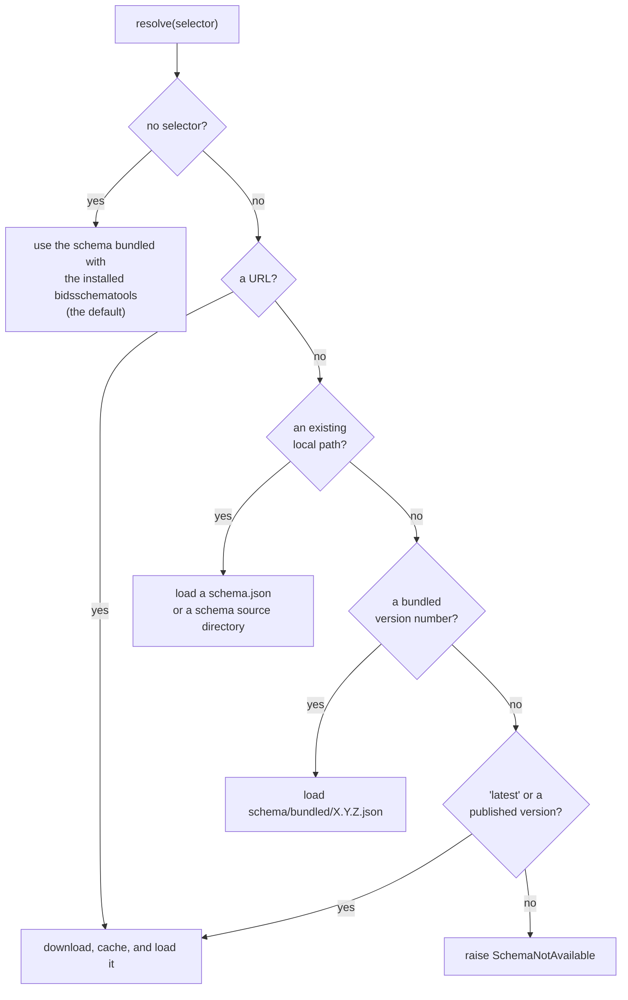
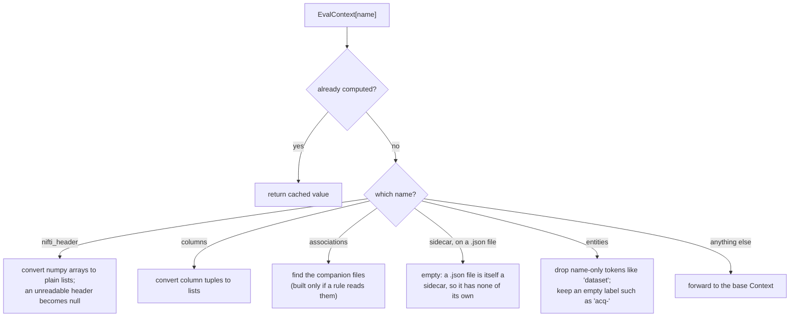
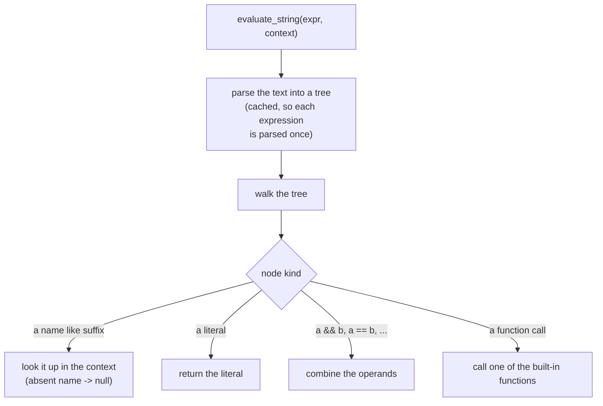
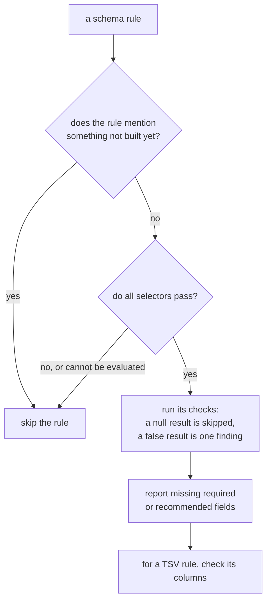
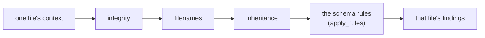
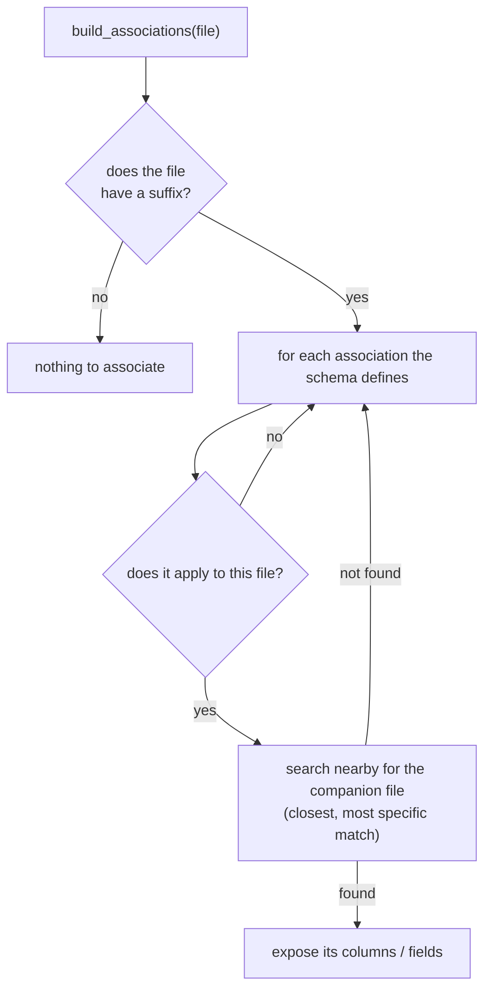
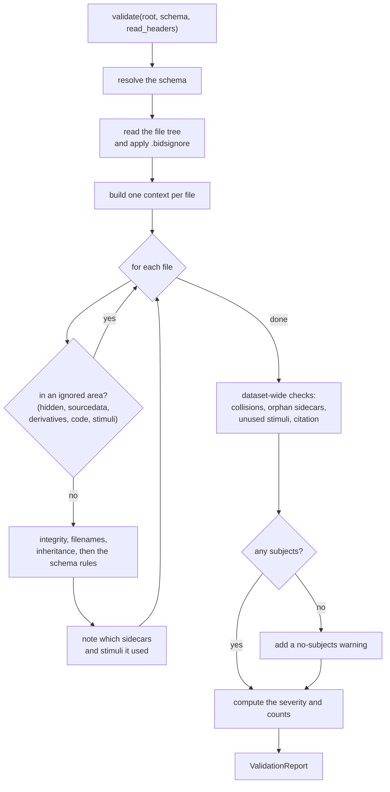

# How the validator works

This document walks through the validation engine stage by stage, in the order
the code runs. It starts from the entry point and goes deeper one piece at a time,
so each concept is introduced before it is used. If terms like rule, context, or
expression are unfamiliar, read [concepts.md](concepts.md) first; it explains them
from scratch with examples. For how this engine relates to the original filename
check, see [what-changed.md](what-changed.md).

All paths below are under `src/bids_validator/`. The engine lives in
`validation/`; it builds on a few files in the package root (`context.py`,
`types/files.py`, `bidsignore.py`) that predate it.

- [A first look at a run](#a-first-look-at-a-run)
- [Reading the BIDS schema](#reading-the-bids-schema)
- [Building the file tree](#building-the-file-tree)
- [Turning one file into a context](#turning-one-file-into-a-context)
- [Evaluating the schema's expressions](#evaluating-the-schemas-expressions)
- [Running the rules](#running-the-rules)
- [Checks written directly in Python](#checks-written-directly-in-python)
- [Looking across the whole dataset](#looking-across-the-whole-dataset)
- [The result and how it is shown](#the-result-and-how-it-is-shown)
- [The full pipeline, end to end](#the-full-pipeline-end-to-end)
- [Module layout](#module-layout)

## A first look at a run

The entry point is `validate(root, *, schema=None, read_headers=True, max_rows=1000)`
in [`validation/validate.py`](../src/bids_validator/validation/validate.py)
(line 68). At a high level it does five things: pick a schema, read the dataset's
files into a tree, build a small context object for each file, run the checks on
each file, and then run a few checks that need to see the whole dataset at once.



`validate` never raises because the dataset is bad. Every problem becomes a
finding in the report, and the per-file work is wrapped so that one unreadable
file turns into a single warning rather than stopping the run (`validate.py:168`,
`_validate_one`). `validate_file(root, relpath)` (`validate.py:133`) is the same
machinery but returns only one file's findings; it still reads the whole dataset
first, because some checks depend on neighbouring files.

The sections below open up each of those five steps.

## Reading the BIDS schema

Almost everything this validator knows about BIDS, the datatypes, the entities,
the suffixes, the file extensions, the metadata field definitions, and most of the
rules, comes from the BIDS schema rather than from code. The schema is a large
data structure produced by `bidsschematools`. Working this way means the validator
follows the standard as the schema changes, and it can run against more than one
version of BIDS.

Choosing which schema to use is the job of
[`validation/schema/resolve.py`](../src/bids_validator/validation/schema/resolve.py).
Everything else in the engine receives one already-resolved schema and reads from
it, so no other module has to think about BIDS versions.



By default `resolve(None)` uses whatever schema the installed `bidsschematools`
ships, which tracks the current stable BIDS version. Six dereferenced schemas are
also bundled in `validation/schema/bundled/` (1.8.0 through 1.11.1), so a specific
version can be selected without a network connection. A local `schema.json`, a
schema source directory, or a remote URL all work too; downloaded schemas are
cached on disk by [`schema/cache.py`](../src/bids_validator/validation/schema/cache.py).

Once a schema is resolved,
[`schema_introspect.py`](../src/bids_validator/validation/schema_introspect.py)
is the small module that reads the vocabulary out of it: `datatypes()`,
`suffixes()`, `extensions()` (longest first, so `.nii.gz` is matched before
`.gz`), the entity short-and-long names, the value pattern for each entity, the
metadata field definitions, and the set of "directory recordings" (formats like
`.ds` and `.ome.zarr` that are directories on disk but represent a single
recording). These results are cached per schema, so reading them repeatedly during
a run is cheap.

Older schemas need one accommodation. The list of context-variable names lives at
`meta.context.properties` in current schemas but one level deeper in 1.8.0 and
1.9.0. The context object reads it from either place and falls back to an empty
list if it finds neither, so an old schema runs (with reduced coverage) instead of
raising.

## Building the file tree

Before any checking happens, the dataset's files are read into an in-memory tree.
`FileTree.read_from_filesystem`
([`types/files.py`](../src/bids_validator/types/files.py)) walks the directory once
and builds an immutable tree of `FileTree` nodes, each wrapping a path. Doing this
up front means the rest of the run never lists directories again; it only reads
file contents, and those reads are cached.

Two details matter later. A `FileTree` is hashable (its parent and children are
excluded from equality), which lets it be used as a cache key for the content
loaders. And `relative_path` gives a node's path from the dataset root, with a
trailing slash on directories, which is the form the ignore patterns and the
existence checks compare against.

Just before validation, `_read_tree` (`validate.py:57`) also applies the
dataset's `.bidsignore` file, pruning any paths it lists (see
[`bidsignore.py`](../src/bids_validator/bidsignore.py)). If the `.bidsignore`
contains a pattern this code does not support (an inverted `!` line), it gives up
on filtering and validates the unfiltered tree rather than risk hiding files; that
fallback is deliberate.

## Turning one file into a context

The schema's rules are written against named variables: a rule might say "this
applies when `suffix == 'T1w'`" or "`RepetitionTime` must be in `sidecar`". To
evaluate such a rule for a given file, the engine first builds an object that maps
those names (`suffix`, `datatype`, `sidecar`, `nifti_header`, `columns`,
`entities`, and so on) to the file's actual values. That object is the file's
context.

It is built in two layers. The base layer is `Context`
([`context.py`](../src/bids_validator/context.py)), which parses the filename into
entities, datatype, suffix, and extension (`FileParts.from_file`) and lazily reads
file contents through a small set of cached loaders (`load_json`, `load_tsv`,
`load_nifti_header`, `load_sidecar`). These loaders are the only place file
contents are read, so each file is read at most once.

The second layer is `EvalContext`
([`validation/context.py`](../src/bids_validator/validation/context.py), line 89),
a read-only mapping that the rule engine actually evaluates against. It forwards
most names straight to the base `Context`, but it intercepts a few where the raw
value would either have the wrong Python type for the expression language or would
break a BIDS rule:



Each interception has a concrete reason:

- The expression language indexes the NIfTI header as plain numbers. The loader
  keeps numpy arrays for efficiency, but a numpy array indexed by the expression
  language would silently produce no value, which would make a header rule look
  failed on every NIfTI. Converting to plain lists here avoids that.
- A `.json` file is a sidecar. By the BIDS inheritance principle a sidecar does
  not have a sidecar of its own, so reading `sidecar` on a `.json` file returns
  empty. This also stops a data file's metadata from being checked twice, once via
  the data file and once via its sidecar.
- A filename token with no value, such as the `dataset` in
  `dataset_description.json`, is parsed as an entity with no label. It is not a
  real entity, so it is dropped; an empty label such as `acq-` is kept, because
  that is itself a problem the rules should catch.

Producing one context per file is `iter_file_contexts` (`validation/context.py:222`).
It walks the tree and yields a `Context` for each file. There is one special case:
a directory recording such as `sub-01_task-rest_meg.ds` is a directory on disk but
represents a single recording, so it is yielded as one context and not descended
into. Without this, the files inside it would be checked individually and reported
as stray empty files.

## Evaluating the schema's expressions

Many of the schema's rules are short expressions: a selector like
`suffix == 'bold'` that says when a rule applies, and a check like
`"RepetitionTime" in sidecar` that says what must be true. These are evaluated by
[`validation/expressions.py`](../src/bids_validator/validation/expressions.py).
Parsing the expression text into a syntax tree is done by `bidsschematools`; this
module walks that tree against a context and returns a value.



The most important behaviour to understand is what happens when something cannot
be determined. Looking up a name that is not in the context returns `null`
(Python `None`), not an error. From there, `null` spreads: indexing `null`,
reading a field of `null`, or doing arithmetic with `null` all return `null`. And
operations that could otherwise raise, a malformed regular expression, a division
by zero, a number stored as text, are caught and also turned into `null`.

This matters because of how the rule engine treats `null`, described in the next
section: a check that evaluates to `null` is skipped rather than reported. The
reason is the target stated in [what-changed.md](what-changed.md): this validator
is meant to agree with the reference validator, and reporting a problem the data
does not actually have is worse than missing one. So whenever the engine cannot be
sure, it stays quiet. You will see this same choice in several of the Python
checks below.

A few details are worth knowing if you read this module. It follows JavaScript
semantics, not Python's, because the schema was written against the JavaScript
reference validator: an empty list or object is truthy, an empty string is falsy,
and `&&` and `||` return one of their operands rather than a boolean. There is a
fixed table of thirteen built-in functions (`type`, `match`, `count`, `intersects`,
`exists`, and so on); a function the schema uses that this table does not know
raises a distinct error so the rule engine can skip that rule. The semantics are
pinned by a set of test vectors that ship inside the schema itself
(`meta.expression_tests`), which `tests/validation/test_expressions.py` runs.

## Running the rules

With a context for a file and a way to evaluate expressions, the rule engine
([`validation/engine.py`](../src/bids_validator/validation/engine.py), line 71,
`apply_rules`) runs the schema's rules against that file. The schema groups its
rules; this engine evaluates four groups: generic boolean checks, required and
recommended sidecar fields, dataset-description fields, and TSV column rules.

For each rule the engine first decides whether the rule applies (its selectors),
then runs what the rule asserts:



The pieces:

- A rule's checks are combined with "and": the first one that is definitely false
  produces one finding, and a check that comes back `null` is skipped, as
  described above (`_eval_checks`, `engine.py:156`).
- Field rules (`_eval_fields`, `engine.py:211`) report a missing required field as
  an error and a missing recommended field as a warning, reading the data file's
  merged sidecar (or, for the dataset group, `dataset_description.json`). Optional
  and prohibited fields produce nothing.
- The value of a field that is present is checked separately
  (`_validate_present_values`, `engine.py:296`), and only on `.json` files, against
  its schema definition. Checking only the `.json` file avoids reporting the same
  bad value twice. A field name can map to several definitions; a value is only
  flagged if it fails all of them, so a name that is reused in different contexts
  is not falsely flagged.
- A small list of rules that reference aggregates this engine does not build yet
  (for example `coordsystems` or `atlas_description`) is skipped wholesale
  (`_UNPOPULATED_FIELDS`, `engine.py:50`), again to avoid evaluating a rule against
  data that is not there.

## Checks written directly in Python

Some checks cannot be expressed as a schema boolean, so they are written by hand,
ported from the reference validator. Each is a small module under
[`validation/rules/`](../src/bids_validator/validation/rules/), and each returns a
list of findings for one file. They run in a fixed order:



**Integrity** ([`rules/integrity.py`](../src/bids_validator/validation/rules/integrity.py))
catches files that are broken before any schema rule could apply: an empty file, a
NIfTI whose header cannot be read, a corrupt gzip. Two points are worth noting. A
symlink is skipped, because an unfetched git-annex file is a symlink with no local
content and must not be reported as empty. And an empty NIfTI produces both an
"empty file" and an "unreadable header" finding, because the reference validator
reports both; the two checks do not suppress each other. The header check only
runs when header reading is enabled, so the fast `--no-headers` mode does not
falsely flag every NIfTI.

**Filenames** ([`rules/filenames.py`](../src/bids_validator/validation/rules/filenames.py))
checks a path against the schema's filename rules: which rule the file matches, and
then its entities, labels, suffix, extension, datatype folder, and location. A file
that matches no rule is reported as not included. This is the same job the old
`is_bids` does, but it produces findings instead of a boolean, and `validate` uses
this one so the two never report the same thing. Derivative filename rules are
skipped, because the default run validates raw files only.

**Inheritance**
([`rules/inheritance.py`](../src/bids_validator/validation/rules/inheritance.py))
reports two problems about how JSON sidecars apply to a data file: when more than
one sidecar in a directory could apply and none is an exact match (an error,
because which one wins is ambiguous), and when a less specific sidecar sets a field
that a more specific one overrides (a warning). It is evaluated from the data
file's point of view, never from a sidecar's, so nothing is reported twice.

**Tabular data** ([`rules/tables.py`](../src/bids_validator/validation/rules/tables.py),
with helpers in `column_types.py` and `values.py`) checks a TSV's columns: that
required columns are present, that extra columns follow the rule's policy, that
index columns are unique, that the first columns are in the required order, and
that each cell has the right type. A column with a wrong-typed cell produces one
finding (matching the reference's count), but it records every offending row so a
tool can highlight them all. Gzipped TSVs are skipped, because they have no header
row (their column names live in a sidecar), and a column whose value is free text,
or whose pattern will not compile, is accepted rather than flagged. The
human-readable "how to fix" text on a finding is generated from the schema
definition itself (`guidance.py`), so the examples stay correct as the schema
changes.

## Looking across the whole dataset

After every file has been checked on its own, a few checks need to see the dataset
as a whole. These run from `dataset_checks`
([`rules/dataset_checks.py`](../src/bids_validator/validation/rules/dataset_checks.py)):

- two paths that differ only by case, which collide on a case-insensitive
  filesystem (an error);
- a `.json` sidecar that no data file uses (an error);
- a file under `stimuli/` that no `events.tsv` references (a warning);
- a `CITATION.cff` that is present but malformed
  ([`rules/citation.py`](../src/bids_validator/validation/rules/citation.py)).

`validate` itself adds one more, a warning when the dataset has no `sub-*`
directories at all.

Deciding whether a sidecar or a stimulus is "used" is the subtle part. Rather than
recompute it, the engine records which sidecars and stimuli the per-file pass
actually resolved, as it resolves them (`collect_viewed`), and the dataset-level
check then flags only what was never touched. This way a file counts as used
exactly when the reference validator would count it.

Some of these checks reach files through associations. An association is a
companion file that travels with a data file: an `events.tsv` next to a recording,
the `.bval`/`.bvec` next to a diffusion image, the `channels.tsv` next to an EEG
file, and so on.
[`validation/associations.py`](../src/bids_validator/validation/associations.py)
finds them for a given data file and exposes their columns and fields to the
expression language under `associations`. It is built only when a rule actually
reads `associations`, and an association that is not found is simply left out, so a
rule that mentions a missing association is skipped rather than failed.



## The result and how it is shown

The findings are plain data objects, so a report can be turned into text, JSON, or
anything else without re-running validation.

- An `Issue`
  ([`issues.py`](../src/bids_validator/validation/issues.py)) is one finding: a
  `code`, a `severity` (`ignore`, `warning`, or `error`), a `location`, an optional
  message, and an optional "how to fix" suggestion. It also carries two extras the
  reference validator does not have: where in the schema the finding came from, and
  a machine-readable hint a tool could use to offer a fix.
- A `FileVerdict` holds one file's findings; a `ValidationReport`
  ([`report.py`](../src/bids_validator/validation/report.py)) holds the whole run:
  the BIDS version checked against, the per-file verdicts, the dataset-level
  findings, and the counts. `is_valid` means no errors; `filtered(...)` returns a
  copy keeping only chosen severities.

Four renderers in [`validation/render/`](../src/bids_validator/validation/render/)
turn a report into output: plain text (what the command line prints), JSON (a flat
list of findings with the run's metadata), SARIF (for code-scanning tools), and a
single self-contained HTML file. Each is a plain function of the report, listed in
one registry the command line dispatches from.

## The full pipeline, end to end

Putting the stages together, here is the whole of `validate` in one picture:



The per-file step (`_validate_one`, `validate.py:168`) runs the four checkers in
the order shown and wraps them so that an unexpected error on one file becomes a
single warning rather than stopping the run. The top-level directories `sourcedata`,
`derivatives`, `code`, and `stimuli`, and any hidden path, are skipped by default
(`_is_ignored`, `validate.py:49`), matching the reference validator.

## Module layout

```
validation/
  validate.py        the run: validate() and validate_file()
  engine.py          runs the schema's rules against a file (apply_rules)
  expressions.py     evaluates one schema expression (and the built-in functions)
  context.py         EvalContext and the per-file walk (iter_file_contexts)
  associations.py    finds a file's companion files
  schema_introspect.py   reads BIDS vocabulary out of a schema
  schema/            schema selection: resolve.py, cache.py, bundled/*.json
  rules/
    integrity.py     empty / unreadable / corrupt files
    filenames.py     filename and path legality
    inheritance.py   ambiguous or overridden sidecars
    tables.py        TSV columns and cell types
    column_types.py  the column value-type checker
    values.py        JSON value-type checking
    guidance.py      the "how to fix" text, from the schema
    dataset_checks.py  collisions, orphan sidecars, unused stimuli
    citation.py      CITATION.cff
  render/            text / json / sarif / html
  report.py          ValidationReport and FileVerdict
  issues.py          Issue, Severity, and the small data types

context.py           the base per-file context and the cached file loaders
types/files.py       the immutable FileTree
bidsignore.py        .bidsignore pattern matching
bids_validator.py    the original is_bids filename check (unchanged)
```

The dependencies run one way. `schema_introspect.py` and `schema/` read a schema
and depend on nothing else in the engine; the rule modules use the context and the
expression evaluator; `validate.py` wires them together. There is no central
controller object and no shared mutable state beyond the per-schema caches, so each
piece can be read and tested on its own.
