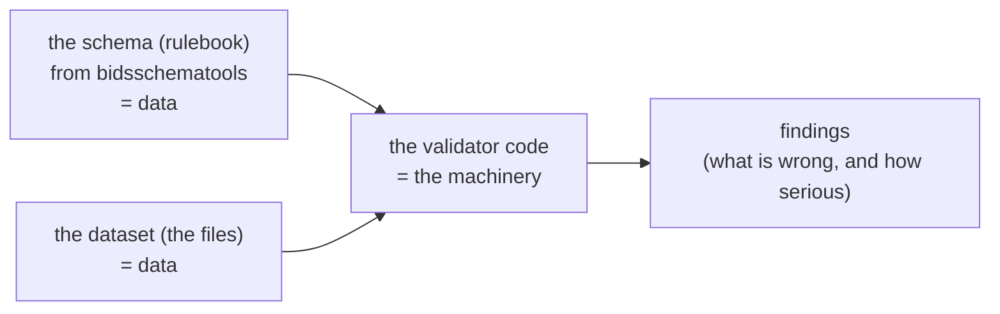
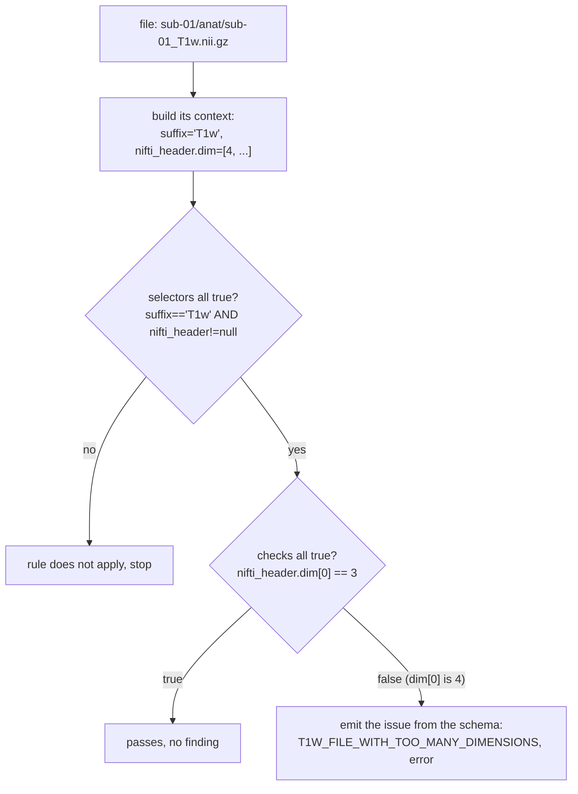
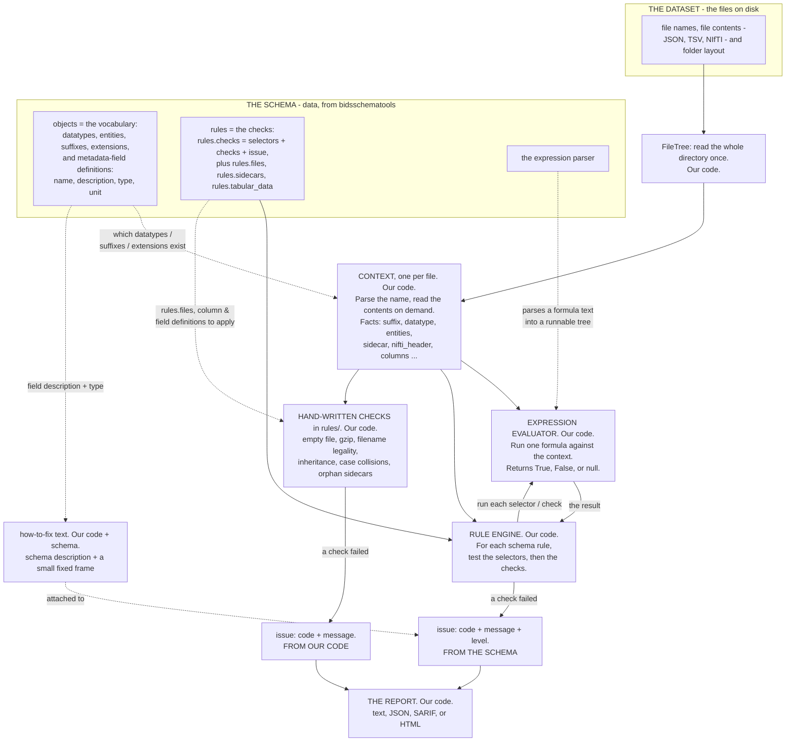
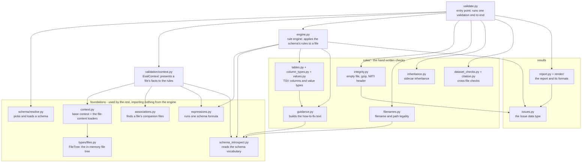

# Core concepts, explained from scratch

If the other docs lost you, start here. This page explains the handful of ideas
the validator is built from, slowly, one at a time, using real examples taken
straight from the code and the schema. Nothing here assumes you have read the
other pages. By the end you should be able to point at any piece and say what it
is and where it comes from.

The order matters, so read top to bottom the first time:

- [The three worlds: schema, dataset, code](#the-three-worlds-schema-dataset-code)
- [What the schema actually is](#what-the-schema-actually-is)
- [An expression: one tiny formula](#an-expression-one-tiny-formula)
- [A context: the facts about one file](#a-context-the-facts-about-one-file)
- [A rule: when, what, and what to report](#a-rule-when-what-and-what-to-report)
- [Rules vs expressions: the difference, and why they are separate](#rules-vs-expressions-the-difference-and-why-they-are-separate)
- [One rule, traced end to end](#one-rule-traced-end-to-end)
- [Where each part of a finding comes from](#where-each-part-of-a-finding-comes-from)
- [Two kinds of checks](#two-kinds-of-checks)
- [The whole workflow in one picture](#the-whole-workflow-in-one-picture)
- [The scripts and how they fit together](#the-scripts-and-how-they-fit-together)
- [What comes from where: a summary](#what-comes-from-where-a-summary)
- [The main imports of each file](#the-main-imports-of-each-file)
- [Glossary](#glossary)

## The three worlds: schema, dataset, code

Almost all confusion about this validator comes from mixing up three separate
things. Keep them apart in your head and everything else falls into place.

1. **The schema** is the rulebook. It is a big block of data (think of a giant
   JSON file) that describes what BIDS allows: which datatypes exist, which
   metadata fields there are, what is required, and so on. It comes from a library
   called `bidsschematools`. **It is data, not code.** It does not "do" anything;
   it just describes the standard.

2. **The dataset** is the thing being checked: the actual files on disk, their
   names, their contents, their folder layout.

3. **The validator code** (this package) is the machinery that reads the dataset
   and checks it against the rulebook, then reports what it found.



The important and slightly surprising part: **most of "what is valid" lives in the
schema, not in the code.** The code is mostly a general-purpose machine that
applies whatever rulebook it is given. Swap in a different schema (a different BIDS
version) and the same code checks against different rules. That is why the code
talks so much about "reading the schema."

## What the schema actually is

The schema is a big nested dictionary. When the code loads it, it can read pieces
out of it by key. It has two halves that matter here: **`objects`** (the
vocabulary, the words BIDS knows) and **`rules`** (the checks).

Here is a real piece of the vocabulary, the definition of the `subject` entity:

```json
schema["objects"]["entities"]["subject"] = {
  "name": "sub",
  "display_name": "Subject",
  "description": "A person or animal participating in the study.",
  "type": "string",
  "format": "label"
}
```

That is how the code knows the `sub-` in `sub-01` is an entity called "subject"
and its value must look like a label. Nothing about that is hardcoded in Python;
it is read from here.

Here is another real piece of vocabulary, the definition of the metadata field
`RepetitionTime`:

```json
schema["objects"]["metadata"]["RepetitionTime"] = {
  "name": "RepetitionTime",
  "description": "The time in seconds between the beginning of an acquisition of one volume and ... (TR). ...",
  "type": "number",
  "exclusiveMinimum": 0,
  "unit": "s"
}
```

Notice it carries a **description**, a **type** (`number`), a bound
(`exclusiveMinimum: 0`), and a **unit** (`s`). Remember this; it is where the
"how to fix" text later comes from.

And here is a real **rule** from the other half of the schema, `rules`. This one
says a `T1w` image must be 3-dimensional:

```json
schema["rules"]["checks"]["anat"]["T1wFileWithTooManyDimensions"] = {
  "selectors": ["suffix == 'T1w'", "nifti_header != null"],
  "checks": ["nifti_header.dim[0] == 3"],
  "issue": {
    "code": "T1W_FILE_WITH_TOO_MANY_DIMENSIONS",
    "message": "_T1w.nii[.gz] files must have exactly three dimensions.",
    "level": "error"
  }
}
```

We will take this rule apart below. For now, just notice three things live inside
it: `selectors`, `checks`, and `issue`, and that `selectors` and `checks` are
**lists of little text strings**. Those strings are the next concept.

## An expression: one tiny formula

Look at one of those strings on its own:

```
suffix == 'T1w'
```

That is an **expression**. It is a single small formula written in a mini-language
(it looks like JavaScript, and it is *not* Python). An expression does exactly one
thing: it takes some facts and computes a value, like `True`, `False`, a number,
or "no value". It knows nothing about BIDS, about files, or about errors. It is
just a formula.

To compute `suffix == 'T1w'`, the formula needs to know what `suffix` is. You hand
it a small dictionary of facts (the "context", next section) and it looks `suffix`
up. Here is the code actually evaluating a few expressions against a tiny set of
facts:

```python
ctx = {"suffix": "T1w", "nifti_header": {"dim": [3, 256, 256, 170]}, "sidecar": {"EchoTime": 0.005}}

evaluate_string("suffix == 'T1w'",        ctx)   # -> True
evaluate_string("nifti_header.dim[0] == 3", ctx)  # -> True
evaluate_string('"EchoTime" in sidecar',   ctx)   # -> True
evaluate_string('"RepetitionTime" in sidecar', ctx)  # -> False
evaluate_string("nonexistent_var == 5",    ctx)   # -> False
```

Two things to take away:

- An expression only ever **returns a value**. It never decides "this is an
  error". Deciding is somebody else's job (the rule, next).
- A name the facts do not contain becomes "no value" rather than a crash. That is
  deliberate, and it is why the validator does not blow up on incomplete data.

One more detail that often confuses people: turning the text `"suffix == 'T1w'"`
into something runnable happens in two steps, done by two different things.
`bidsschematools` **parses** the text into a tree (it understands the grammar).
The validator's own file [`expressions.py`](../src/bids_validator/validation/expressions.py)
then **evaluates** that tree against the facts. So the schema brings the formulas
*and* the parser; our code brings the part that actually runs them.

## A context: the facts about one file

In the example above, `ctx` was the bag of facts. In the real validator that bag
is called the **context**, and there is **one context per file**. It maps the
names an expression might use to that file's real values:

```
for sub-01/anat/sub-01_T1w.nii.gz the context provides, among others:
  suffix        -> "T1w"          (read from the filename)
  datatype      -> "anat"         (read from the folder)
  entities      -> {"sub": "01"}  (read from the filename)
  extension     -> ".nii.gz"
  sidecar       -> { ... the merged JSON metadata ... }   (read from .json files)
  nifti_header  -> { "dim": [3, ...], ... }               (read from the .nii.gz)
  columns       -> { ... }        (for a .tsv, its columns)
```

So the context is just "everything an expression might want to know about this one
file, looked up by name". It is built by parsing the file name and, when needed,
reading the file's contents. The code that builds it is
[`context.py`](../src/bids_validator/validation/context.py).

Now you can see why expressions and contexts go together: an expression is a
question (`suffix == 'T1w'`), and the context is where the answer to the parts of
the question (`suffix`) is found.

## A rule: when, what, and what to report

Go back to the real rule and read it as plain English:

```json
{
  "selectors": ["suffix == 'T1w'", "nifti_header != null"],
  "checks": ["nifti_header.dim[0] == 3"],
  "issue": { "code": "T1W_FILE_WITH_TOO_MANY_DIMENSIONS",
             "message": "_T1w.nii[.gz] files must have exactly three dimensions.",
             "level": "error" }
}
```

A rule has three parts, and each is easy once you know expressions:

- **`selectors` = when does this rule apply?** A list of expressions that must
  *all* be true for the rule to be relevant. Here: only for files whose suffix is
  `T1w`, and only when the NIfTI header could be read. For a `bold` file, the
  first selector is false, so this rule is simply skipped, no finding.
- **`checks` = what must be true?** More expressions, which must *all* be true for
  the file to pass. Here: the first dimension of the header must be 3.
- **`issue` = what to report if a check is false?** A ready-made finding: a code, a
  human message, and a level (error or warning). **All three come straight from
  the schema.**

So a rule is a small package that says: "in this situation (selectors), this must
hold (checks); if it does not, report this (issue)." A rule does not compute
anything itself; it *uses* expressions to make its decisions.

(Not every rule has `checks` and an `issue`. Some rules instead carry a list of
required and recommended `fields` for a sidecar, or required `columns` for a TSV.
Those are the same idea: a "when" plus a "what must hold". The most common shape is
the one above.)

## Rules vs expressions: the difference, and why they are separate

This is the question that trips everyone up, so here it is as plainly as possible.

- An **expression** is a calculator. You give it a formula and a file's facts, and
  it hands back a value. That is the whole of its job. `suffix == 'T1w'` in,
  `True` out.
- A **rule** is a decision built on top of expressions. It uses expressions to
  decide whether it applies and whether the file passes, and it carries the
  consequence (the issue to report when it does not). A rule cannot do its job
  without expressions, but it adds the "when", the "and-all-of-these", and the
  "here is what to say".

A short analogy. An expression is a pocket calculator: type `2 + 2`, it shows `4`.
A rule is a tax form: "if the number in box A is greater than the number in box B,
write 'owes money' in box C." The form *uses* a calculator for the comparison, but
the form is the thing with the conditions and the consequences. The calculator has
no idea what taxes are.

They live in two different files for a concrete reason:

- The calculator, [`expressions.py`](../src/bids_validator/validation/expressions.py),
  is small, fiddly (it has to match the exact behaviour the schema expects), and
  reused in several places. It is tested on its own against a set of example
  formulas that ship inside the schema. Keeping it isolated means there is exactly
  one well-tested place that knows how to run a formula.
- The rule machinery, [`engine.py`](../src/bids_validator/validation/engine.py), is
  the orchestrator: it walks through the schema's rules, asks the calculator to
  evaluate the selectors and checks, and builds findings. It never needs to know
  *how* a formula is computed; it just asks.

Separating "run one formula" from "walk the rules and produce findings" keeps each
file small and each job testable. If they were merged, both would be harder to
follow and harder to trust.

## One rule, traced end to end

Concrete beats abstract. Here is the T1w rule running on a real, broken file: a
`sub-01_T1w.nii.gz` that is accidentally 4-dimensional.



Step by step:

1. The validator builds the context for the file: `suffix` is `"T1w"`,
   `nifti_header.dim` is `[4, ...]`.
2. The engine reaches the T1w rule and evaluates its **selectors**:
   `suffix == 'T1w'` is `True`, `nifti_header != null` is `True`. Both true, so
   the rule applies.
3. The engine evaluates the **check** `nifti_header.dim[0] == 3`. The first
   dimension is `4`, so this is `False`.
4. A check came back false, so the engine emits the rule's **issue** verbatim from
   the schema: code `T1W_FILE_WITH_TOO_MANY_DIMENSIONS`, level `error`, with the
   schema's message. The location (`sub-01/anat/sub-01_T1w.nii.gz`) is filled in
   from the dataset.

That is the entire core loop. Most of the 129 rules in this part of the schema
work exactly like this.

## Where each part of a finding comes from

A finding (the validator calls it an `Issue`) has several parts: a `code`, a
`severity`, a `message`, a `location`, and a "how to fix" `suggestion`. A fair
question is whether these come from the schema or are hardcoded. The honest answer
is "it depends on the part", and here it is in full.

For a **schema rule** like the T1w one:

| Part | Comes from |
|---|---|
| code (`T1W_FILE_WITH_TOO_MANY_DIMENSIONS`) | the schema's `issue` block |
| severity (error) | the schema's `issue.level` |
| message | the schema's `issue.message` |
| location | the dataset (which file failed) |

For a **missing metadata field** (say `RepetitionTime` is required but absent):

| Part | Comes from |
|---|---|
| code (`SIDECAR_KEY_REQUIRED`) | chosen by our code based on the requirement |
| severity | the schema's requirement level (`required` -> error, `recommended` -> warning) |
| message ("missing required field 'RepetitionTime'") | a short sentence frame in our code |
| suggestion ("how to fix") | **built from the schema** (see below) |

The "how to fix" text deserves a close look, because it is the part people assume
is hardcoded and it mostly is not. Here is what the code actually produces for
`RepetitionTime`:

```
The time in seconds between the beginning of an acquisition of one volume and the
beginning of acquisition of the volume following it (TR). Unit: s. Add it to the
JSON, for example {"RepetitionTime": 1.0}.
```

Breaking that sentence into its sources:

- *"The time in seconds ... (TR)."* is the **schema's description** of the field.
- *"Unit: s."* is the schema's **`unit`**.
- *"Add it to the JSON, for example"* is a fixed **sentence frame in our code**
  ([`guidance.py`](../src/bids_validator/validation/rules/guidance.py)).
- `{"RepetitionTime": 1.0}` is an example **generated from the schema's type**:
  the field's `type` is `number`, so the example value is `1.0`. For a text field
  like `Manufacturer` (type `string`) the same code produces `{"Manufacturer": "text"}`.

So "how to fix" is **not** a hardcoded table of advice. It is the field's own
description and type from the schema, wrapped in a small fixed sentence. Change the
schema's description and the advice changes with it.

The one exception is the third kind of check, below.

## Two kinds of checks

You may wonder why there is both an `engine.py` *and* a folder full of checks in
`rules/`. It is because there are two kinds of checks, and they are handled
differently.

1. **Checks the schema can express as a formula.** "A T1w must be 3D", "this field
   is required", "this column must be numeric". These are written as rules *inside
   the schema* and run by the generic engine. There are a lot of them (129 in just
   the `rules.checks` group). Adding one is a schema change, not a code change.

2. **Checks the schema cannot express as a formula.** "Is this file empty (0
   bytes)?" "Is this gzip corrupt?" "Is this filename well-formed?" "Do two paths
   collide on a case-insensitive disk?" None of these can be written as a small
   formula over a file's fields, so they are **hand-written in Python**, one per
   topic, under [`rules/`](../src/bids_validator/validation/rules/)
   (`integrity.py`, `filenames.py`, `inheritance.py`, `dataset_checks.py`). For
   these, the code, severity, and message *are* written in the Python, because the
   check itself is.

Both kinds produce the same `Issue` objects and end up in the same report. The
split is only about *where the check is described*: in the schema (most of them),
or in our code (the few that cannot be).

There is one more distinction that trips people up, so here it is spelled out. The
hand-written checks in `rules/` are *code*, but several of them still **read the
schema** for the facts they check against, even though their logic and their issue
codes are written in Python. "From the schema" is really two separate questions:

- *Is the check itself written in the schema?* Only the engine's rules are. Every
  module in `rules/` is hand-written code.
- *Does the check read schema definitions?* The engine's rules do, and so do about
  half of the `rules/` modules:

| `rules/` module | reads the schema? | what it reads |
|---|---|---|
| `integrity.py` | no | nothing; pure code (empty file, gzip, NIfTI header) |
| `inheritance.py` | no | pure code |
| `dataset_checks.py` | no | pure code (case collisions, orphan sidecars, unused stimuli) |
| `citation.py` | no | pure code (CITATION.cff) |
| `filenames.py` | yes | `rules.files` and the entity definitions |
| `tables.py` | yes | the column rules and `objects.columns` |
| `values.py` | yes | the metadata field type definitions |
| `guidance.py` | yes | field descriptions and types, to build the how-to-fix text |

The thing that is unique to the **engine's schema rules** is that even their issue
text (code, message, level) comes from the schema. Every hand-written check, schema-reading or not, spells out its own issue code and message in code.

## The whole workflow in one picture

Here is the entire flow on one page: from the files on disk, through building the
context, to running the rules and producing findings. Every element is shown,
including the schema and what it feeds into. The solid arrows are the processing
pipeline; the dotted, labelled arrows are the schema handing a piece of
information to a step.



Reading it in words:

1. The **dataset** is read into a `FileTree`, then one **context** is built per
   file. The context is mostly the file's own facts, but it leans on the schema's
   **vocabulary** to know which datatypes, suffixes, and extensions are real.
2. The **rule engine** walks the schema's **rules**. For each one it asks the
   **expression evaluator** to run the selectors and checks against that file's
   context. The evaluator can only run a formula because the schema's **parser**
   turned the formula text into something runnable.
3. When a schema rule's check fails, the engine emits the rule's **issue**, whose
   code, message, and level all come straight from the schema. The "how to fix"
   text is attached, built from the schema's field description and type plus a
   small fixed sentence.
4. In parallel, the **hand-written checks** in `rules/` look at the same context
   for the things the schema cannot phrase as a formula. Some of them still read
   schema definitions (filename rules, column and field definitions), but their
   issue codes and messages are written in our code.
5. Both sources of findings flow into the **report**, which is rendered as text,
   JSON, SARIF, or HTML.

## The scripts and how they fit together

The chart above shows what happens at run time. This second chart shows the files
it happens in, and which file imports which. An arrow from A to B means A uses
(imports) B, so the arrows run from the high-level files down to the foundations.



A few things to read off it:

- `validate.py` is the only entry point. It imports everything else and wires one
  run together.
- The **foundations** (`expressions.py`, `schema_introspect.py`,
  `schema/resolve.py`, `types/files.py`) are imported by the higher-level files but
  import nothing from the engine themselves. That one-way flow is why each can be
  read and tested on its own.
- The hand-written checks in `rules/` mostly stand alone; a few (`filenames.py`,
  `tables.py`, `guidance.py`) reach down to `schema_introspect.py` for the
  definitions they check against.
- Everything that produces a finding ends at `issues.py`, and the final report is
  assembled by `report.py` and `render/`.

The per-file detail (what each import is actually used for) is in
[The main imports of each file](#the-main-imports-of-each-file) below.

## What comes from where: a summary

| Thing | Where it comes from |
|---|---|
| the list of valid datatypes, entities, suffixes, extensions | the schema |
| every metadata field's description, type, unit, bounds | the schema |
| the rules (their selectors, checks, and issue text) | the schema |
| the example formulas that pin the calculator's behaviour | the schema |
| the parser that turns `"suffix == 'T1w'"` into a tree | `bidsschematools` |
| the evaluator that runs that tree | our code (`expressions.py`) |
| reading files and walking the directory tree | our code |
| checks that cannot be a schema formula (empty file, gzip, filenames, collisions) | our code (`rules/*.py`) |
| the "how to fix" sentence frame | our code (`guidance.py`) |
| the field description and example value inside that sentence | the schema |
| the file names, file contents, folder layout | the dataset on disk |
| the output formats (text, JSON, SARIF, HTML) | our code (`render/`) |

If you remember one line: **the schema says what is valid; the dataset is what we
check; our code is the machine that applies one to the other (plus a few checks
the schema cannot phrase, plus the reporting).**

## The main imports of each file

A quick way to see how the pieces relate is to look at what each file imports. The
arrows only ever point one way, from the simple foundations up to the orchestrator,
which is exactly why they are separate files.

| File | What it imports (the meaningful ones) | So it is... |
|---|---|---|
| [`schema_introspect.py`](../src/bids_validator/validation/schema_introspect.py) | `bidsschematools` only | a leaf: it just reads vocabulary out of a schema |
| [`expressions.py`](../src/bids_validator/validation/expressions.py) | `bidsschematools.expressions` (the parser) | the calculator: nothing else in the engine; it only runs formulas |
| [`schema/resolve.py`](../src/bids_validator/validation/schema/resolve.py) | `bidsschematools.schema.load_schema`, `cache` | only finds and loads a schema |
| [`rules/guidance.py`](../src/bids_validator/validation/rules/guidance.py) | `schema_introspect` | turns schema field definitions into "how to fix" text |
| [`rules/integrity.py`](../src/bids_validator/validation/rules/integrity.py) | `issues` only (plus stdlib `gzip`) | a self-contained hand-written check |
| [`context.py`](../src/bids_validator/validation/context.py) | the base `Context`, `associations`, `expressions`, `schema_introspect` | builds the per-file facts |
| [`engine.py`](../src/bids_validator/validation/engine.py) | `expressions`, `schema_introspect`, `rules.*`, `issues` | runs the schema's rules using the calculator |
| [`validate.py`](../src/bids_validator/validation/validate.py) | `schema`, `context`, `engine`, `rules`, `report`, `bidsignore` | the top: it wires everything together |

Read that table bottom to top and you have the whole design: a couple of leaves
that only read a schema or run a formula, a layer that builds per-file facts and
runs rules, and one file at the top that connects them. Nothing reaches "sideways"
or "downward into" a more complex module, which is what keeps each file readable on
its own.

## Glossary

- **schema**: the rulebook, a big block of data from `bidsschematools` describing
  what BIDS allows.
- **objects** (part of the schema): the vocabulary, the definitions of datatypes,
  entities, suffixes, extensions, and metadata fields.
- **rules** (part of the schema): the checks, expressed as selectors + checks +
  an issue, or as field/column requirements.
- **expression**: one small formula written as text, like `suffix == 'T1w'`. It
  computes a value from a file's facts and nothing more.
- **the evaluator** (`expressions.py`): the code that runs an expression. The
  "calculator".
- **context**: the bag of facts about one file, looked up by the names expressions
  use (`suffix`, `sidecar`, `nifti_header`, ...).
- **selector**: an expression in a rule that says *when* the rule applies.
- **check**: an expression in a rule that says *what must be true*.
- **rule**: a package of selectors + checks + an issue. It uses expressions to
  decide, and carries the consequence.
- **the engine** (`engine.py`): the code that walks the rules and produces
  findings.
- **issue / finding**: one reported problem, with a code, a severity, a location,
  a message, and a suggestion.
- **severity**: how serious a finding is (`error` or `warning`; `ignore` exists
  for findings that are recorded but silenced).
- **suggestion ("how to fix")**: a short sentence, mostly built from the schema's
  field description and type, telling you how to fix a finding.
- **hand-written check**: a check that cannot be a schema formula (empty file,
  gzip integrity, filename legality, case collisions), written directly in Python
  under `rules/`.

## Where to go next

Now that the vocabulary makes sense, [architecture.md](architecture.md) walks
through the whole engine in this same order, with more detail and the full set of
flowcharts. [tutorial.md](tutorial.md) shows how to actually run it.
