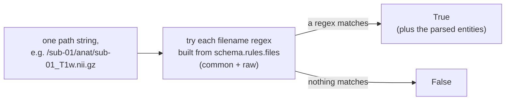
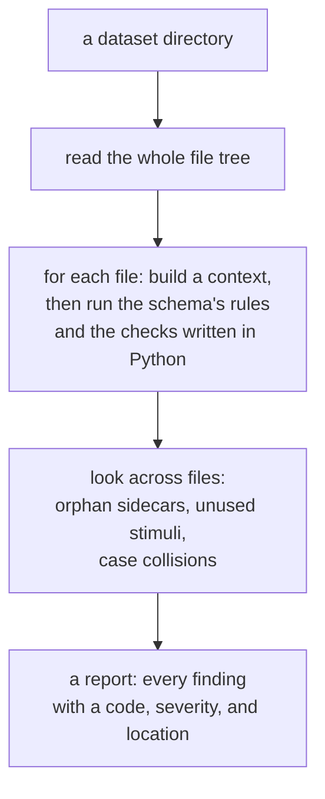
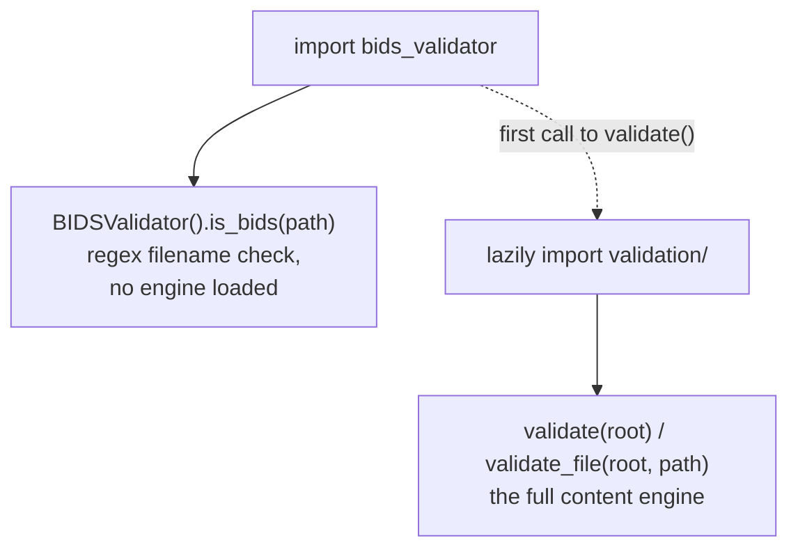

# From a filename check to a full validator

This package used to do one thing: given a file path, tell you whether the path
looks like a valid BIDS filename. It still does that, unchanged. On top of it we
added a second, much larger capability: reading a whole dataset and checking its
contents against the BIDS schema, the way the reference validator does.

This page explains what the old behaviour was, what the new behaviour is, how the
two fit together, and why we built it the way we did. It is meant to be read
before [architecture.md](architecture.md), which goes through the new engine in
detail.

## What the package did before

The original entry point is `BIDSValidator.is_bids(path)` in
[`bids_validator.py`](../src/bids_validator/bids_validator.py). You give it one
path, relative to the dataset root with a leading slash, and it returns a boolean:

```python
from bids_validator import BIDSValidator

BIDSValidator().is_bids("/sub-01/anat/sub-01_T1w.nii.gz")   # True
BIDSValidator().is_bids("/sub-01/anat/sub-01_T1.nii.gz")    # False (no such suffix)
```

It works entirely on the path string. On first use it builds a list of regular
expressions from the BIDS schema, by calling
`bidsschematools.rules.regexify_filename_rules` on the `common` and `raw`
filename-rule groups (`bids_validator.py:98`, `_init_regexes`). `parse(path)`
(`bids_validator.py:110`) then tries each regex against the path and returns the
entities it captured (or an empty dict if none matched); `is_bids` is just
"did anything match" (`bids_validator.py:172`). A handful of helper predicates
(`is_top_level`, `is_session_level`, `is_phenotypic`, and so on) read the same
parsed entities.



This is exactly what tools like pybids and mne-bids need: a fast, dependency-light
way to ask "is this a BIDS file name?" for a path they already have in hand.

What it does **not** do is everything else a validator is usually expected to do.
It looks at one path at a time, never opens the file, and never looks at any other
file. So it cannot tell you that a required sidecar field is missing, that a TSV
column has the wrong type, that an `events.tsv` references a stimulus that is not
there, that a NIfTI is empty, or that two files collide on a case-insensitive
filesystem. And it answers only yes or no: there are no findings, no severities,
and no message explaining what is wrong.

## What we added

The new code, all under [`validation/`](../src/bids_validator/validation/), reads
a whole dataset and produces a list of findings, matching the output of the
reference [Deno validator](https://github.com/bids-standard/bids-validator). The
public entry point is `validate(root)`:

```python
from bids_validator import validate

report = validate("/path/to/dataset")
print(report.is_valid, report.counts)     # e.g. False {'error': 3, 'warning': 41, 'ignore': 0}
for verdict in report.files:
    for issue in verdict.issues:
        print(issue.severity.value, issue.code, issue.location)
```

Where the old check took a path and returned a boolean, the new one takes a
directory and returns a structured report:



The new capability covers what the old one could not:

| Question | Old `is_bids` | New `validate` |
|---|---|---|
| Is this filename valid? | yes | yes |
| Is a required sidecar field present? | no | yes |
| Does a TSV column have the right type? | no | yes |
| Does `events.tsv` reference a missing stimulus? | no | yes |
| Is a NIfTI empty or unreadable? | no | yes |
| Do two paths collide on case? | no | yes |
| What exactly is wrong, and how serious? | no (boolean only) | yes (findings with severity and a message) |
| Which BIDS version? | the installed schema | any bundled or supplied schema |

Every new "yes" reads the same source of truth the old check did: the BIDS schema,
which comes from `bidsschematools`. The schema is where "required" and
"recommended" fields, the allowed column types, the entities and suffixes, and the
list of BIDS versions are all defined. The old `is_bids` read it to build filename
regexes; the new `validate` reads the same schema for every row above. What is new
is not the definitions but the code that opens a dataset's files and checks their
contents against them: `bidsschematools` supplies the schema (and a parser for the
small expressions inside it), but it does not read your dataset, and neither did
`is_bids`. The new code under `validation/` does.

The last row is that same schema loaded two ways: `is_bids` always used whatever
`bidsschematools` was installed, while `validate` can also load a specific bundled
version or a schema you point it at (see
[Schema selection](cli-reference.md#schema-selection)).

## How the two fit together

We did not replace the old behaviour or rewrite it. `bids_validator.py` is
unchanged, and a test (`tests/test_is_bids_canary.py`) pins `is_bids` so it cannot
drift. The two live side by side in the same package:



The full engine is imported lazily (`__init__.py`, the `__getattr__` hook): just
importing `bids_validator`, or calling `is_bids`, does not pull in the validation
engine or its dependencies. The first call to `validate` or `validate_file` is
what loads it. This keeps the original, lightweight use case as fast as it was
before, while making the new capability available from the same import.

So a consumer chooses by what it needs:

- `BIDSValidator().is_bids(path)` to ask about one filename, cheaply, as pybids
  and mne-bids do.
- `validate(root)` (or the `bids-validator` command) to validate a whole dataset.

## What the new code is

The new behaviour is a set of modules under
[`validation/`](../src/bids_validator/validation/). At a high level they are:

- `schema/` and `schema_introspect.py`, which choose a BIDS schema and read its
  vocabulary (datatypes, entities, suffixes, extensions, field definitions).
- `context.py` (in the package root) and `validation/context.py`, which turn the
  file tree into one small context per file: the parsed filename plus the file's
  contents, read on demand.
- `expressions.py`, which evaluates the short expressions the schema's rules are
  written in.
- `engine.py` and the `rules/` modules, which run the schema's rules and the
  checks that cannot be written as a schema expression (empty files, filename
  legality, inheritance, TSV columns, dataset-level checks).
- `report.py`, `issues.py`, and `render/`, which hold the findings and turn them
  into text, JSON, SARIF, or HTML.

[architecture.md](architecture.md) walks through each of these in order. Three
choices shaped the whole set.

**It reuses this package's file model.** Rather than add a second way to read
files, the engine builds on the existing `FileTree`
([`types/files.py`](../src/bids_validator/types/files.py)) and the cached content
loaders in [`context.py`](../src/bids_validator/context.py). A file is read at
most once, through one set of loaders, whether the read is for the file's own
context or for a companion file. See
[architecture.md](architecture.md#turning-one-file-into-a-context) for how that
context is assembled.

**It reads the schema instead of hardcoding BIDS.** As noted above, the
datatypes, entities, suffixes, extensions, field definitions, and most of the
rules all come from the `bidsschematools` schema at runtime. Because the schema is
just data that flows in, the validator can run against a different BIDS version:
six versions are bundled, and a local or remote schema also works (see
[Schema selection](cli-reference.md#schema-selection)).

**It is built to agree with the reference validator.** The target is to produce
the same findings as the Deno validator. A practical consequence runs through the
whole engine: when a check cannot determine an answer from what is available, it
does nothing rather than guess, because a wrong complaint is worse than a missed
one. That choice is explained where it comes up in
[architecture.md](architecture.md). The measured result is on
[benchmarks.md](benchmarks.md): 99.9% of the reference validator's error findings
at the latest stable schema, with no invented error codes on raw datasets.

## Why we did it

The reference BIDS validator is excellent but ships as a Deno binary, which is an
extra runtime to install and call out to. A Python tool that wants to validate a
dataset in-process, as part of a larger workflow, previously had only the filename
check in this package (which is not a full validator) or a subprocess call to
Deno. The goal here was a complete, schema-driven validator that runs as a normal
Python import and library call, produces the same findings as the reference, and
still ships the lightweight filename check the existing ecosystem relies on. That
is what the `validation/` engine provides, and what the rest of these docs
describe.

## Where to go next

- [architecture.md](architecture.md) walks through the new engine in detail, with
  flowcharts for each stage.
- [tutorial.md](tutorial.md) shows the command line and the Python API in use.
- [benchmarks.md](benchmarks.md) reports how closely it matches the reference
  validator.
